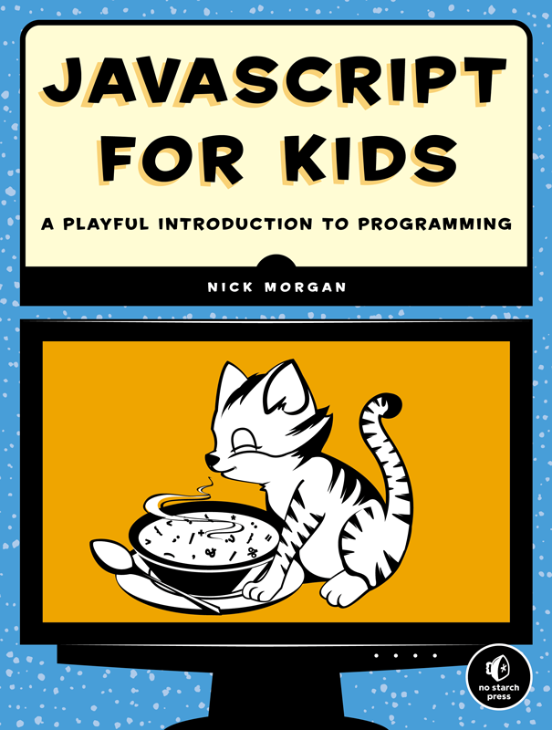
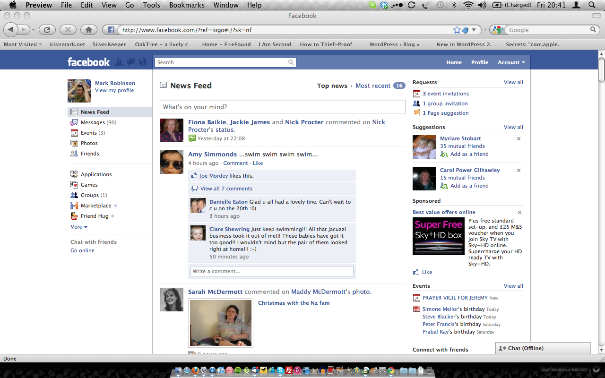
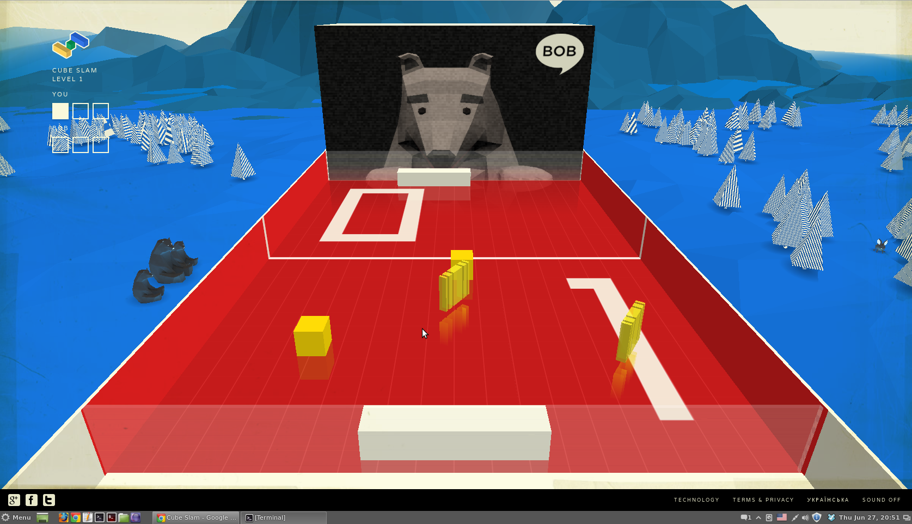
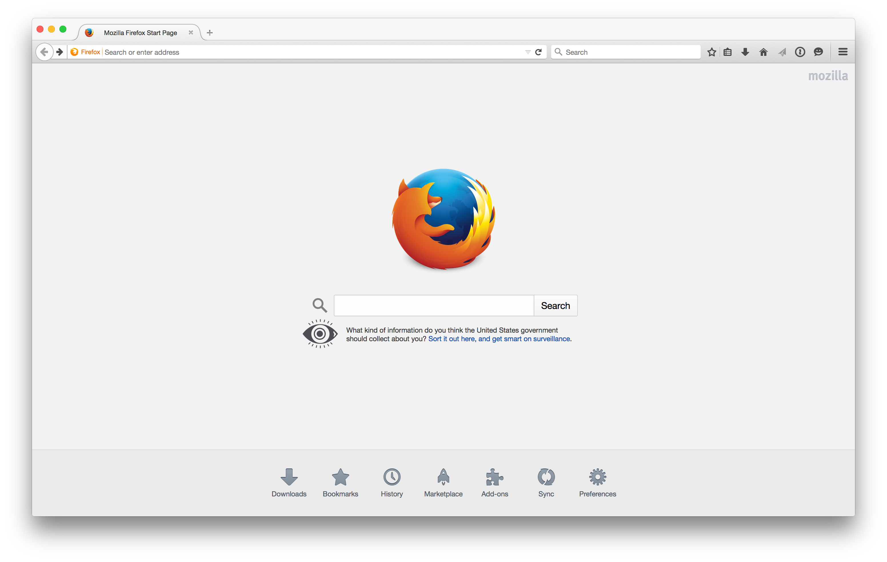
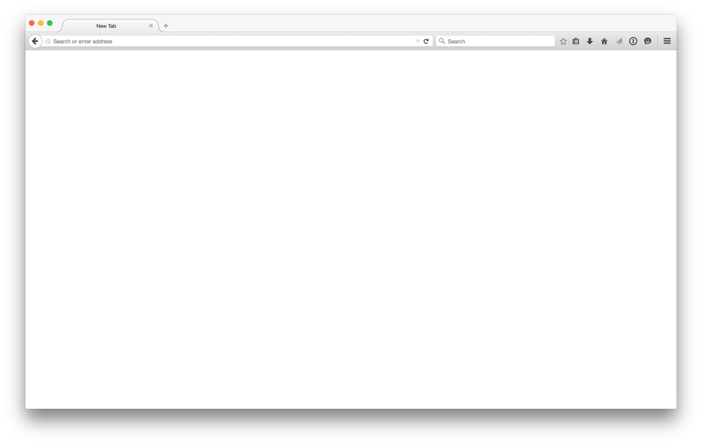
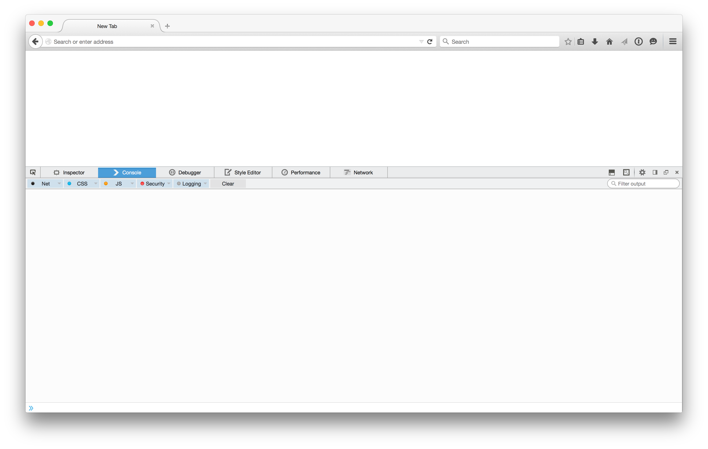

## "JavaScript for Kids" Coding Class
### May/June 2015 - 4th and 5th Grade
### Lesson 1

--- 

## Welcome to the Class!

---

# _Lesson 1_
- Introductions and Books
- What is JavaScript?
- Setting up Machines!
- Data Types and Variables
-- Overview of types, and variables (15 min)
-- Incrementing and decrementing (15 min)
-- Working with strings (15 min)
-- Booleans (15 min)

---

## Introductions

---

---

## What is JavaScript?

---

## Computer language that powers the majority of Internet

---

---

---

---

## Learn basics of JavaScript over the next six weeks!

---

## By Week 6, putting together a simple game

---

## Setting up your machines

---

--- 

---

## Update FireFox to 37.0.2

---

## about:blank

---

---

## 1. Tools Menu
## 2. Select Web Developer 
## 3. Select Web Console

---

---

## Let's Write Some JavaScript!

---

## Data Types

---

## Numbers, Strings, Booleans

---

## Data Types (Numbers)

- 10 + 10
- 17 - 7
- 9 * 5
- 50 / 2
- 8 / 1 + 3

### Try it out! (Page 15)

---

## Variables

---

## Variables

- var age = 13;
- var numberOfStudents = 4 + 4;
- numberOfStudents * 2

---

## Naming Variables

- Rules
-- Cannot have spaces
-- Cannot start with a number
-- Usually lowercase
- Join words with Camel Case
-- numberOfStudents, lengthOfFootballField, timeInSchool

### Try it out! (Page 19)

---

## Incrementing and Decrementing

- ++ and -- operator
- += and -= operator

---

## Try it out!
## My birthday is in 5 days from now. How long in seconds until my birthday?
### (Page 20 if you need help)

--- 

## Data Types (Strings)

---

## Data Types (Strings)

- "Hello World"
- 'Hello World'
- var greeting = 'Hello World';
- var greeting = 'Hello ' + 'World';

### Try it out! (Page 23)

---

## Working with Strings

- name.length
- name[0]
- name.slice(0,5)
- .toUpperCase() and toLowerCase()

### Try it out! (Page 25)

---

## Try it out!
## Extract the word "RoseHill" from the sentence "Rose Garden Hill Top"

---

## Data Types (Booleans)

---

## Data Types (Booleans)

- var raining = false;
- var thursday = true;
- Operators
-- ! (not)
-- && (and)
-- || (or)

### Try it out! (Page 30)

---

## Comparisons with Booleans

- <, >, <=, >=
- height < minimumHeight
- mySecretNumber === yourGuess
- !=
- == vs. ===

### Try it out! (Page 33)

---

## PG-13 Movie Theater Example!

### var age = 12;
### var accompanied = false;
### var allowed = ...

---

## End of Lesson 1!

